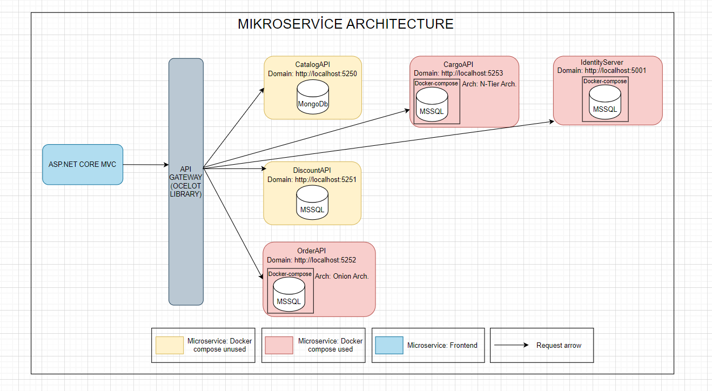

<h1>MultiShop ECommerce Site Project</h1>

<h3>1. Entrance</h3>

Multishop e-commerce site is an e-commerce platform where users can buy and sell products, send comments and notifications, track cargo, and perform many operations such as admin operations. Multishop application handles all these operations in a microservice architectural structure, thus increasing the modularity and flexibility of our application.

<h3>2. Used Technologies</h3>

Asp.Net Core 8.0 API, Asp.Net Core 8.0 Mvc, Entityframework Core, MSSQL, MongoDb, Docker, DockerCompose, Automapper, Redis, IdentityServer, Generic Repository Design Pattern, CQRS Design Pattern, Mediator, Onion Architecture, Microservices Architecture

<h3>3. Language and Development Environment Used: C# - .Net 8.0</h3>

<h3>4. General Outlines of the Architecture Used in the Project</h3>

