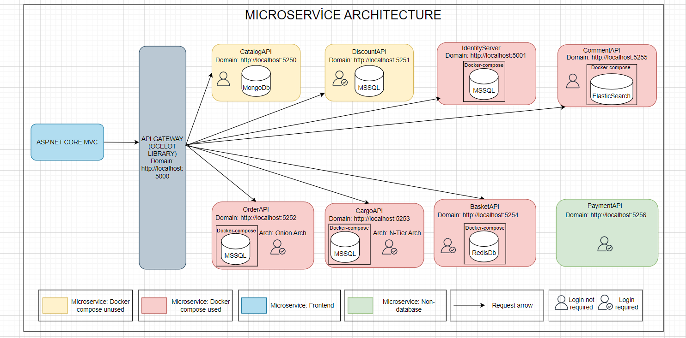
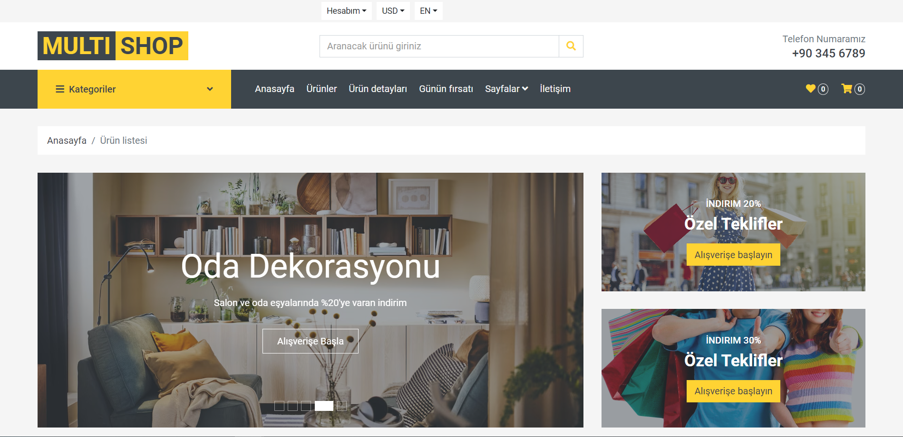
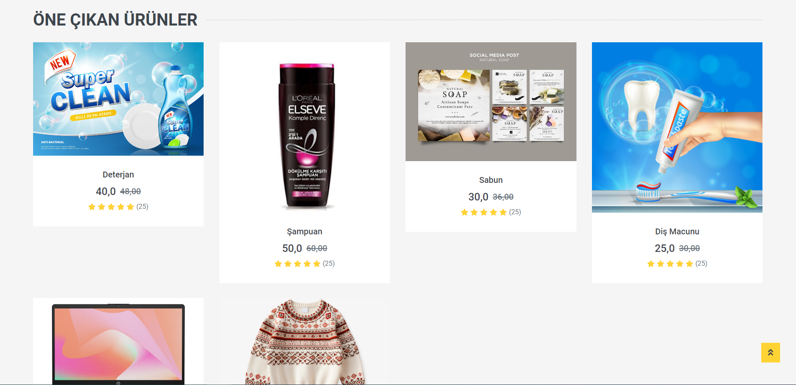
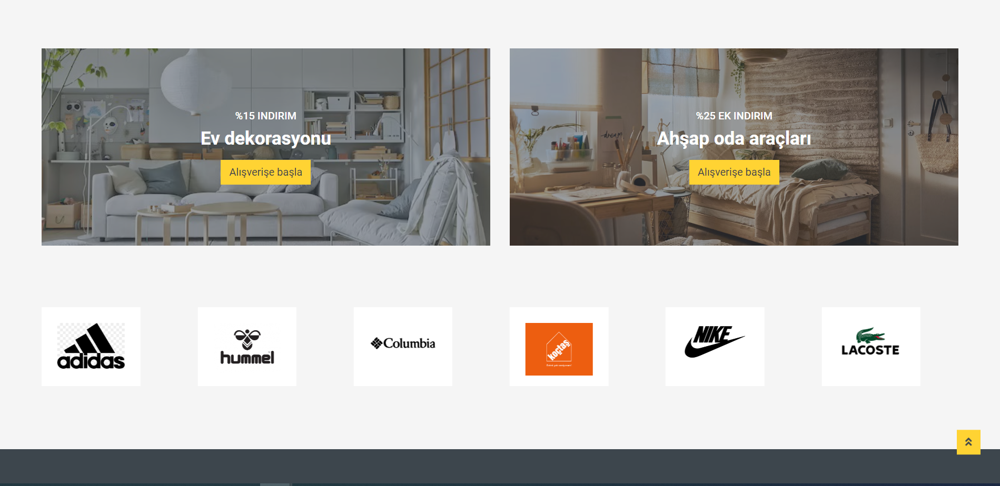
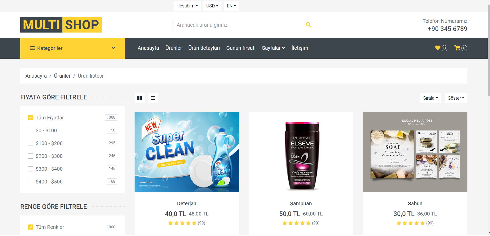
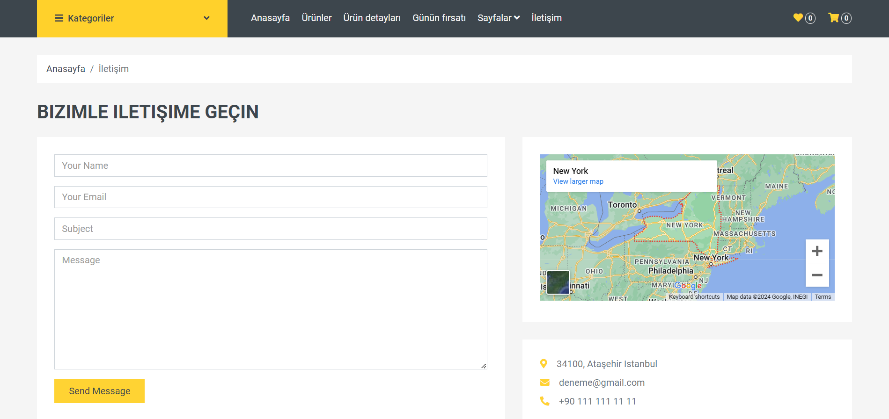
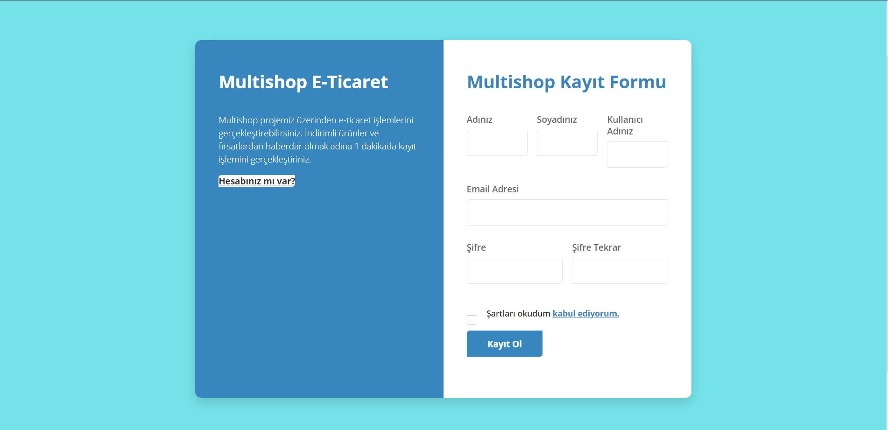
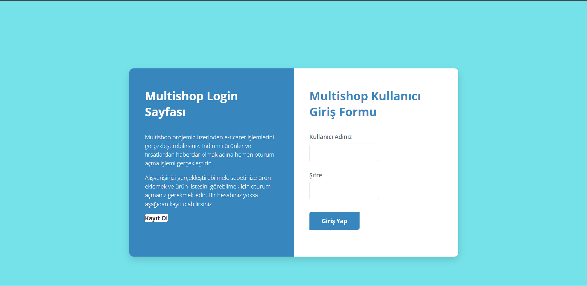
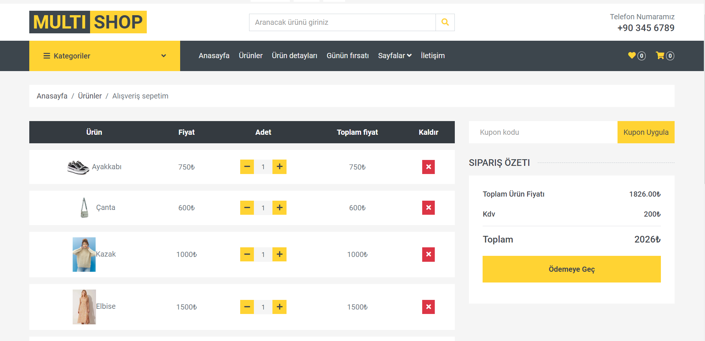
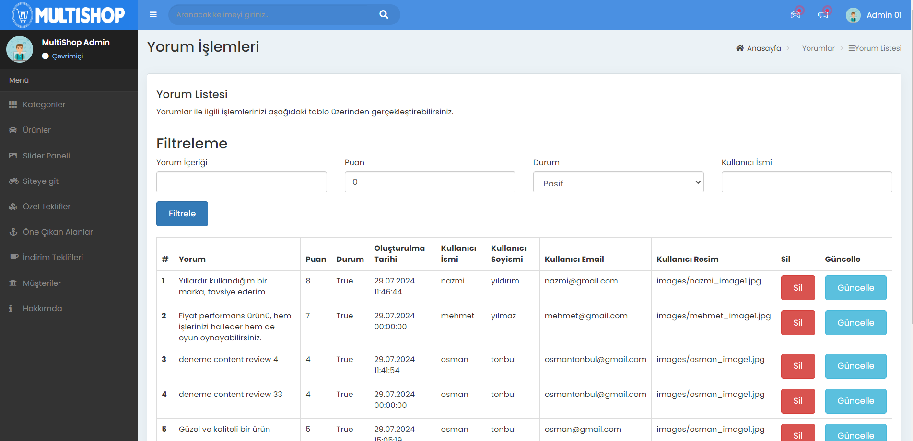

<h1>MultiShop ECommerce Site Project</h1>

<h3>1. Entrance</h3>

Multishop e-commerce site is an e-commerce platform where users can buy and sell products, send comments and notifications, track cargo, and perform many operations such as admin operations. Multishop application handles all these operations in a microservice architectural structure, thus increasing the modularity and flexibility of our application.

<h3>2. Used Technologies</h3>

Asp.Net Core 8.0 API, Asp.Net Core 8.0 Mvc, Entityframework Core, MSSQL, MongoDb, ElasticSearchDb, Kibana, Nest and Elastic.Clients Library, Docker, DockerCompose, Automapper, Redis, IdentityServer, Generic Repository Design Pattern, CQRS Design Pattern, Mediator, Onion Architecture, Microservices Architecture

<h3>3. Language and Development Environment Used: C# - .Net 8.0</h3>

<h3>4. General Outlines of the Architecture Used in the Project</h3>

<h3>5. Screenshots</h3>
<h4>Anasayfa</h4>

<h4>Ürünler</h4>

<h4>İletişim</h4>

<h4>Kayıt Ol</h4>

<h4>Giriş Yap</h4>

<h4>Sepet</h4>

<h4>Admin</h4>

<h3>6. Setup</h3>
<ul>
    <li>If Docker is not installed on your computer, download and install it.</li>
    <li>
Then open the terminal and enter the "docker-compose up" command.</li>
<li>
After entering the command, all databases in our project will work with the docker container.</li>
<li>Then open the MultiShop.Order.Persistance layer in the terminal and enter the "update-database" command. In this way, tables related to the order database will be reflected in the database.</li>
<li>Then go to the "multiple startup projects" section and start the microservices in our project and then run the project by pressing the start button.</li>
</ul>
<b>Note: </b>You can access the Turkish document of the project from the ReadmeTr file.
