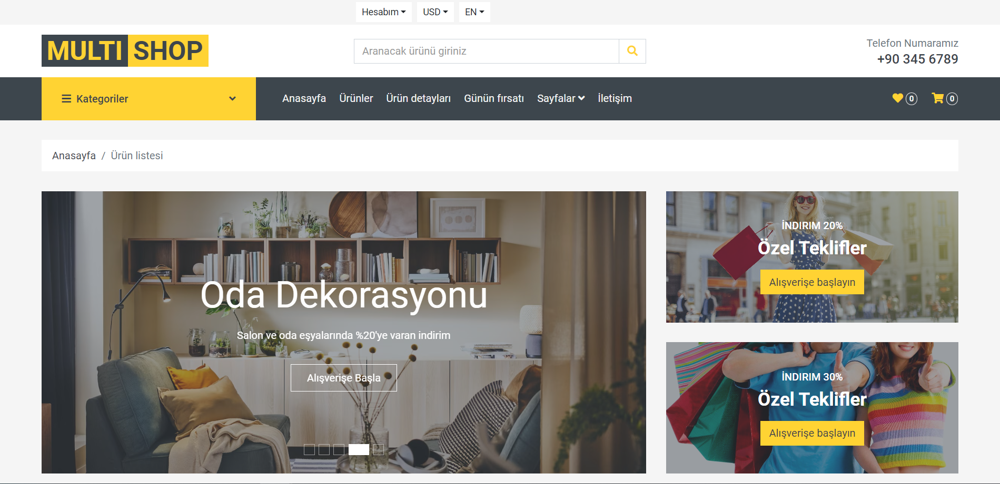
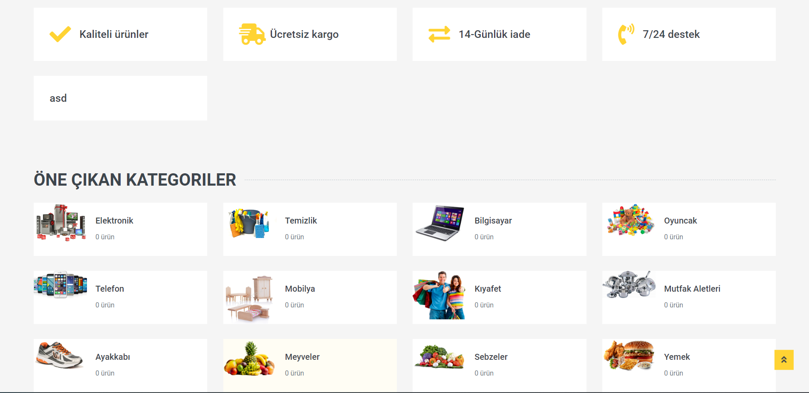
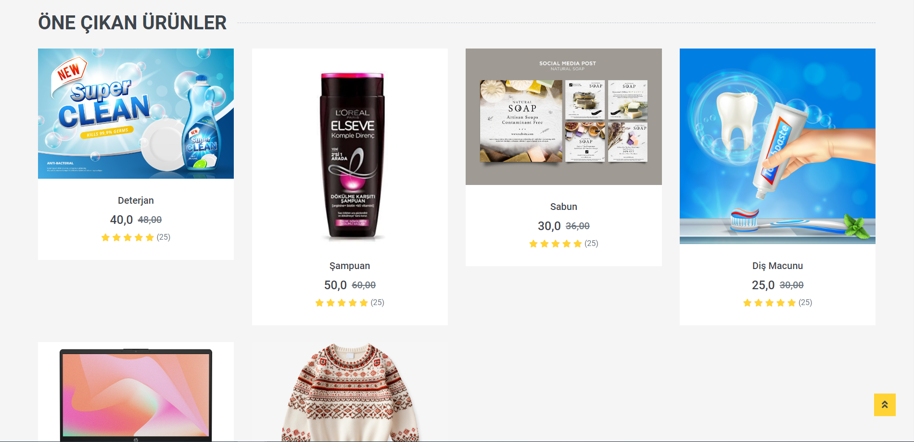
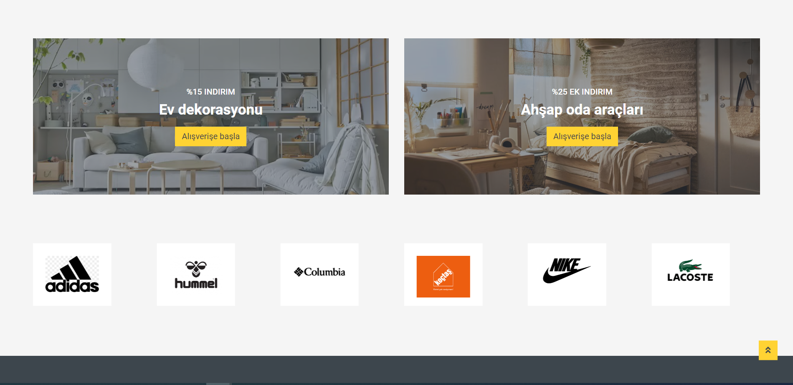
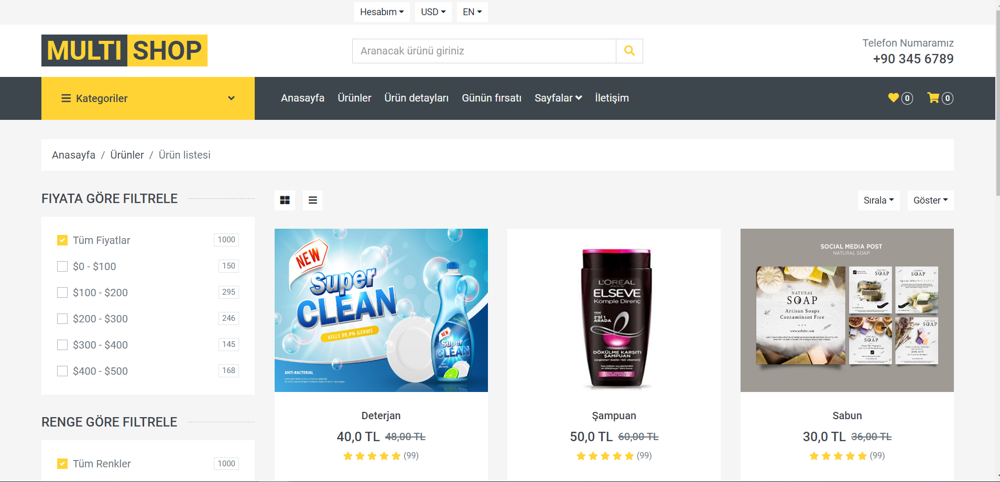
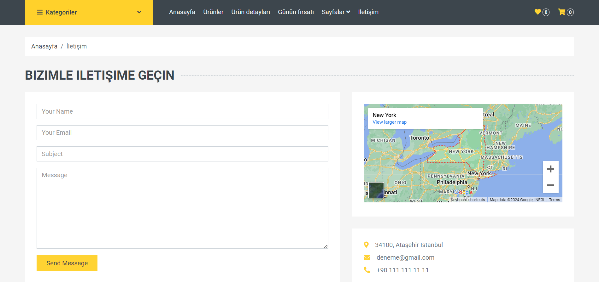
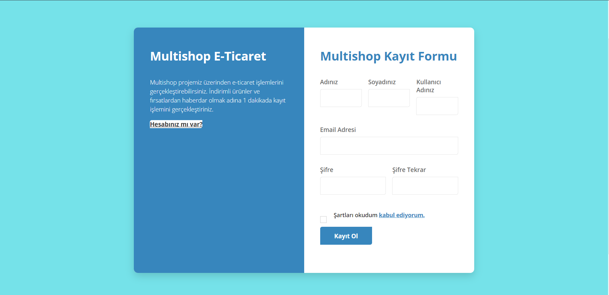
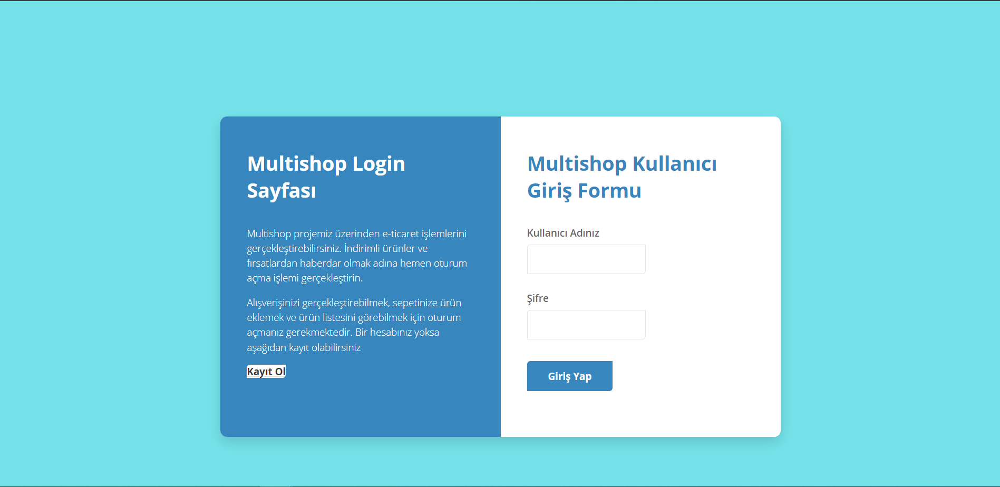
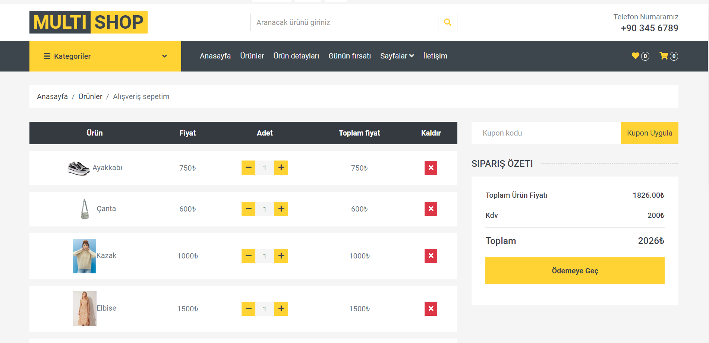
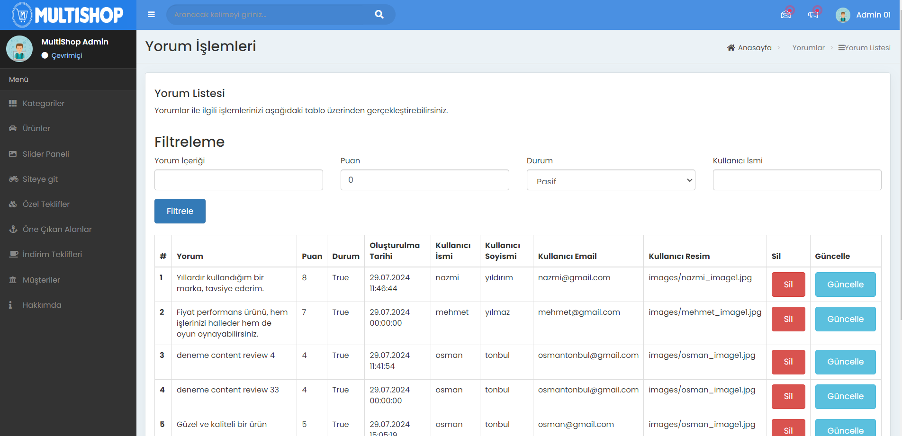

<h1>MultiShop E-Ticaret Sitesi</h1>

<h3>1. Giriş</h3>

Multishop e-ticaret sitesi, kullanıcıların ürün alıp satabildiği, yorum ve bildirim gönderebildiği, kargo takibi yapabildiği, yönetici işlemleri gibi birçok işlemi gerçekleştirebildiği bir e-ticaret platformudur. Multishop uygulaması tüm bu işlemleri mikroservis mimarisi ile ele alarak uygulamamızın modülerliğini ve esnekliğini arttırmaktadır.

<h3>2. Kullanılan Teknolojiler</h3>

Asp.Net Core 8.0 API, Asp.Net Core 8.0 Mvc, Entityframework Core, MSSQL, MongoDb, ElasticSearchDb, Kibana, Nest and Elastic.Clients Library, Docker, DockerCompose, Automapper, Redis, IdentityServer, Generic Repository Design Pattern, CQRS Design Pattern, Mediator, Onion Architecture, Microservices Architecture

<h3>3. Kullanılan Dil ve Geliştirme Ortamı: C# - .Net 8.0</h3>

<h3>4. Projede Kullanılan Mimarinin Genel Hatları</h3>

<h3>5. Ekran Görüntüleri</h3>
<h4>Anasayfa</h4>

<h4>Ürünler</h4>

<h4>Ürün Detay(Geliştirilme aşamasında)</h4>

<h4>İletişim</h4>

<h4>Kayıt Ol</h4>

<h4>Giriş Yap</h4>

<h4>Sepet</h4>

<h4>Admin</h4>

<h3>6. Kurulum</h3>
<ul>
    <li>Docker bilgisayarınızda kurulu değilse, indirip kurunuz.</li>
    <li>
Kurduktan sonra visual studio'da terminali açınız ve "docker-compose up" komutunu giriniz.</li>
<li>
Komut girildikten sonra projemizdeki tüm veritabanları docker container ile beraber ayağa kalkacaktır.</li>
<li>Daha sonra terminalde MultiShop.Order.Persistance katmanını açınız ve "update-database" komutunu giriniz. Bu sayede order veritabanı ile ilgili tablolar veritabanına yansıyacaktır.</li>
<li>Daha sonra "multiple startup projects" bölümüne giderek projemizdeki mikroservisleri start durumuna getiriniz ve ardından start butonuna basarak projeyi çalıştırınız.</li>
</ul>
